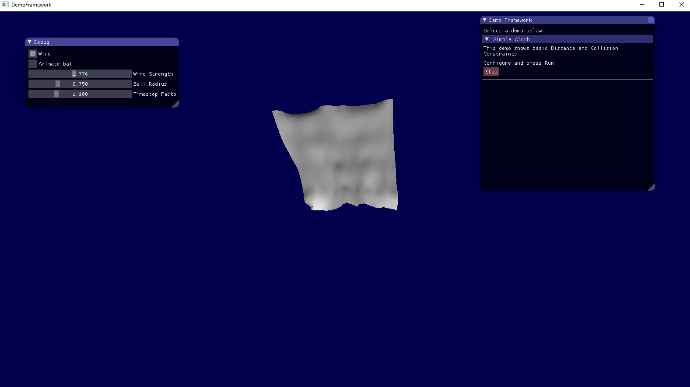

# dynamics demos
Several physics based demos

## cloth simple demo 
* Implementing some ideas from: http://matthias-mueller-fischer.ch/publications/STAR2013.pdf
* Basic Distance and Collision constraints
* Force fields (wind)
* Iterative solver
* Slow motion (with Stiffness adjustment)
* Normal computing

## Images

## Notes
This project uses Dear <a href="https://github.com/ocornut/imgui">ImGui</a>
